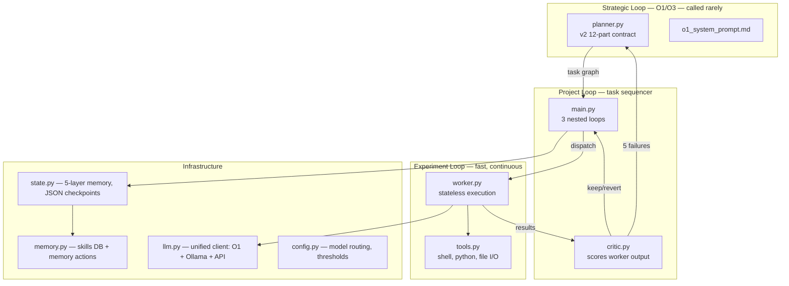

# 01 Lab — Development Log

Living document tracking what we're building, why, and where we are.
Commit messages have the details — this has the narrative.

---

## Architecture (Oracle-validated 2026-03-13)

O1 was given the objective with zero context about our existing code.
It independently designed the same architecture we already built.
Confidence: 0.85. Full response: `docs/lab/oracle-v2-clean-room-response.json`



## File Structure

```
01/
├── CANON.md                          # Source of truth (product spec)
├── CLAUDE.md                         # Quick reference for AI assistants
├── README.md                         # Overview + fundamental question
├── DEVLOG.md                         # ← YOU ARE HERE
├── .gitmessage                       # Conventional commit template
│
├── ai-lab/                           # Core engine (~1,300 LOC)
│   ├── main.py                       # Three nested loops (186 LOC)
│   ├── planner.py                    # Strategic planning, v2 contract (320 LOC)
│   ├── worker.py                     # Stateless task execution (65 LOC)
│   ├── critic.py                     # Evaluator / scorer (113 LOC)
│   ├── state.py                      # 5-layer memory, checkpoints (121 LOC)
│   ├── memory.py                     # Skills DB + memory actions (130 LOC)
│   ├── llm.py                        # Unified LLM client (186 LOC)
│   ├── config.py                     # Model routing + thresholds (101 LOC)
│   ├── tools.py                      # Deterministic tools (86 LOC)
│   ├── ask_o1.py                     # Direct O1 CLI
│   │
│   ├── o1_system_prompt.md           # Strategist role definition (v2)
│   ├── o1_next_question_v2.md        # 12-part strategic query contract
│   ├── o1_next_question_mvp.md       # v1 contract (preserved for reference)
│   │
│   ├── oracle-v2-clean-room.md       # Clean room Oracle prompt (no bias)
│   ├── oracle-v2-architecture-review.md  # Biased version (unused)
│   │
│   └── goals/
│       └── 001-model-optimization.md # First validation goal
│
├── docs/
│   ├── chat.md                       # Original 4,461-line design conversation with GPT-5.4
│   ├── frontierscience-paper (1).pdf # Research paper
│   └── lab/
│       ├── architecture.md           # Mermaid diagrams (aligned to v2 language)
│       ├── o1-strategy-prompt.md     # Full strategy doc with draftbench data
│       ├── o1-o3-deployment-decision.md  # Codex's deployment analysis
│       ├── oracle-v2-clean-room-response.json  # O1's full architecture validation
│       └── model-eval/
│           ├── README.md             # Scorecard across all models
│           ├── gpt54-q1-protocol.md  # GPT-5.4 on protocol gaps
│           ├── gpt54-q2-platform.md  # GPT-5.4 on platform + full eval harness (2,691 lines)
│           ├── o3-q1-protocol.md     # O3 on protocol gaps + schema delta
│           ├── o3-q2-platform.md     # O3 on platform decision
│           └── codex-q2-platform.md  # Codex on platform decision
│
└── references/
    ├── AutoResearch-mac/
    │   ├── autoresearch-karpathy/    # Original Karpathy autoresearch
    │   ├── autoresearch-mlx/         # MLX fork (trevin-creator)
    │   └── autoresearch-macos/       # macOS fork (miolini)
    └── draftbench/                   # Model pairing optimizer (alexziskind1)
```

## Decision Log

| Date | Decision | Rationale | Source |
|------|----------|-----------|--------|
| 2026-03-13 | Strategic tier is model-agnostic, eval-gated | Don't hardcode O1 — any reasoning model can fill the tier | O3 Q1, GPT-5.4 Q1 |
| 2026-03-13 | Local-first architecture, raw API | pgvector + RRF beats Assistants API for our use case | All 3 models unanimous |
| 2026-03-13 | Claude Code is the orchestrator | Other models are tools it routes to, not competitors | User decision |
| 2026-03-13 | v2 strategic query contract (12-part) | Synthesized best of O3, GPT-5.4, Codex evaluations | docs/lab/model-eval/ |
| 2026-03-13 | Architecture validated by Oracle | O1 clean-room design converged on our existing architecture | oracle-v2-clean-room-response.json |
| 2026-03-13 | Goal 001: model optimization | Known-answer validation — draftbench predicts the outcome | goals/001-model-optimization.md |

## Current Status

### What's Built (all committed, all pushed)
- [x] Three nested loops (strategic → project → experiment)
- [x] v2 strategic query contract (12-part, with confidence threshold)
- [x] Upgraded system prompt (uncertainty contract, pre-mortem, adjudicator role)
- [x] Memory actions (strategist → skills DB feedback loop)
- [x] Unified LLM client (O1/O3 + Ollama + standard API)
- [x] State checkpointing with resume
- [x] Conventional commit hook
- [x] Oracle architecture validation
- [x] Goal 001 defined

### What's Next
- [ ] Wire draftbench `sweep.py` as a tool in `tools.py`
- [ ] Pull missing Ollama models (qwen2.5:1.5b, qwen2.5:32b)
- [ ] Build the 5-task benchmark suite for quality scoring
- [ ] Run Goal 001 end-to-end
- [ ] Validate convergence against draftbench predictions

### On Deck (not blocking)
- [ ] Extract GPT-5.4's eval harness into `ai-lab/evals/knowledge_plane/`
- [ ] Build the A/B retrieval comparison (local vs hosted)
- [ ] Add vector search to skills DB (currently tag-based)
- [ ] Observability beyond logging

## V-Model Progress

```
30,000 ft ─── Oracle validates architecture ✅ ◄── WE ARE HERE
              │
20,000 ft ─── Goal 001 defined, tools identified
              │
10,000 ft ─── Wire draftbench, build benchmark suite
              │
Ground    ─── Run end-to-end, observe convergence
              │
10,000 ft ─── Validate results against predictions
              │
20,000 ft ─── Extract learnings, update heuristics
              │
30,000 ft ─── Architecture confirmed or corrected
```

## Model Evaluation Archive

Three OpenAI models (O3, GPT-5.4, Codex) were asked the same two questions.
Full responses in `docs/lab/model-eval/`. Summary:

| Model | Q1 (Protocol) | Q2 (Platform) | Notable |
|-------|---------------|---------------|---------|
| O3 | Drop-in schema delta | Tables + decision flow | Best operational answers |
| GPT-5.4 | Best essay, 5 archetypes | Full eval harness (2,691 lines) | Self-promoted as O1 replacement |
| Codex | Clean reframe | Direct "95%, skip it" | Most concise |
