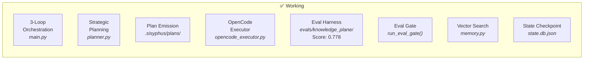
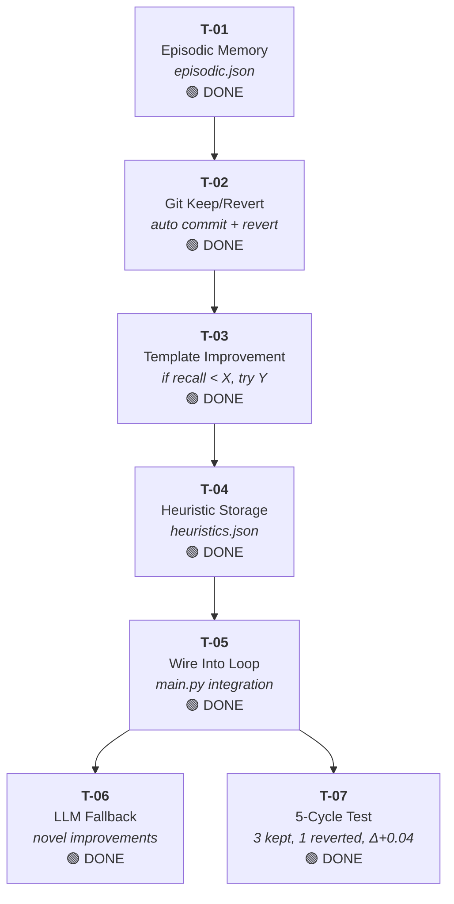
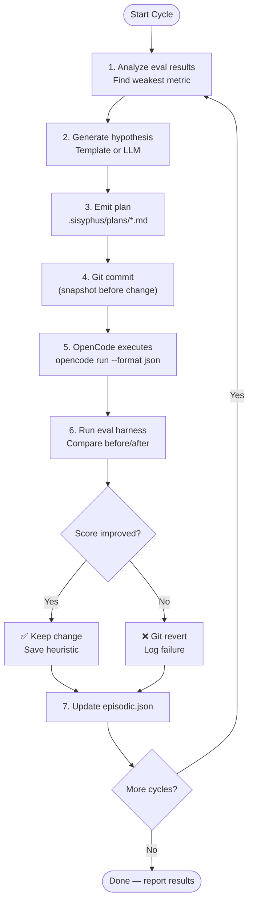
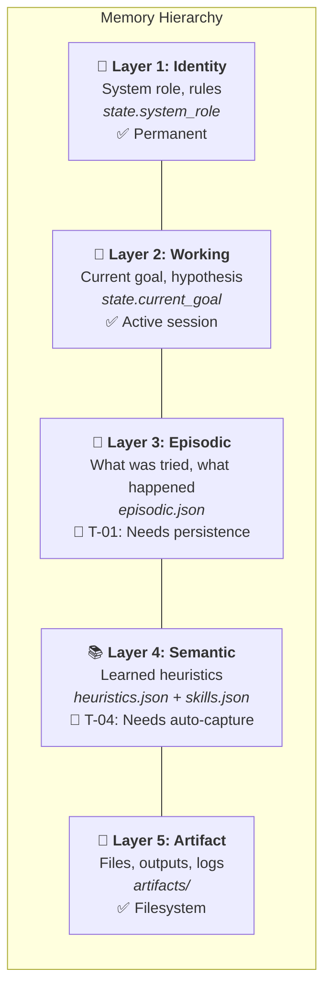

# Autonomous Self-Improvement Loop — Roadmap

> **Goal:** Replace OpenClaw with a transparent, measurable, self-improving system we fully control.
> **Oracle Decision:** 2026-03-14, O1 confidence 0.85

## Where We Are Today



## What We're Building (Oracle Task Graph)



## The Autonomous Loop (What It Will Do)



## Memory Architecture (5-Layer, O1 Design)



## Design Decisions (Oracle-Chosen)

| Decision | Choice | Why |
|----------|--------|-----|
| **Memory format** | JSON files | Git-trackable, no deps, matches existing skills.json |
| **Task generation** | Hybrid (templates + LLM) | Templates for known patterns, LLM for novel cases |
| **Keep/revert** | Git-based | Commit before change, revert on regression. Auditable. |
| **Where to build** | Extend `memory.py` | Centralize memory, reuse vector search |
| **First test** | 5 unattended cycles | Enough to see multiple keep/revert decisions |
| **Third-party deps** | None | Self-reliant. No OMO notepad/boulder dependency. |

## Score Progression

```
Baseline:       0.547  ████████████████████████████░░░░░░░░░░░░░░░░
Cycle 1 grader: 0.562  █████████████████████████████░░░░░░░░░░░░░░░
Cycle 2 cite:   0.696  ███████████████████████████████████░░░░░░░░░
Cycle 3 facts:  0.748  █████████████████████████████████████░░░░░░░
Cycle 4 dedup:  0.778  ██████████████████████████████████████░░░░░░
── autonomous loop (T-07 validation) ──────────────────────
Auto cycle 1:   0.772  █████████████████████████████████████░░░░░░░  KEEP Δ+0.006
Auto cycle 2:   0.784  █████████████████████████████████████░░░░░░░  REVERT Δ-0.026
Auto cycle 3:   0.808  ██████████████████████████████████████░░░░░░  KEEP Δ+0.016
Auto cycle 4:   0.797  █████████████████████████████████████░░░░░░░  KEEP Δ+0.019
Oracle target:  0.600  ██████████████████████████████░░░░░░░░░░░░░░  ← exceeded
Next target:    0.850  ██████████████████████████████████████████░░
Perfect:        1.000  ██████████████████████████████████████████████
```

## Module Map (Current)

| File | Role | LOC | Status |
|------|------|-----|--------|
| `main.py` | 3-loop orchestration + autonomous improvement loop | ~600 | ✅ Working |
| `planner.py` | O1 strategic planning + templates + LLM fallback | ~800 | ✅ Working |
| `opencode_executor.py` | OpenCode JSON event bridge | ~170 | ✅ Working |
| `worker.py` | Stateless task execution | ~65 | ✅ Working |
| `critic.py` | Worker output evaluation | ~90 | ✅ Working |
| `state.py` | 5-layer state + checkpoint + EpisodicEntry | ~140 | ✅ Working |
| `memory.py` | Skills DB + vector search + episodic + heuristics | ~400 | ✅ Working |
| `config.py` | Model routing + thresholds + paths | ~105 | ✅ Working |
| `llm.py` | Unified LLM client | ~150 | ✅ Working |
| `tools.py` | Python exec, shell, file I/O, git snapshot/revert | ~170 | ✅ Working |
| `evals/knowledge_plane/` | Eval harness (10 cases, 4 metrics) | ~900 | ✅ Score: ~0.80 |

## Key Files Reference

| Document | What It Is |
|----------|-----------|
| `CANON.md` | Product spec authority — all decisions checked against this |
| `docs/ORIGIN.md` | Design narrative from founding conversation |
| `docs/lab/OpenCode/model-provider-strategy.md` | Provider/model/agent mapping |
| `docs/lab/OpenCode/oracle-autonomous-loop-response.json` | This roadmap's source decision |
| `docs/lab/OpenCode/o3-OpenCode.md` | Original OMO integration decision (B now, D later) |
| `ai-lab/o1_system_prompt.md` | Chief Strategist role definition |

## What "Replace OpenClaw" Means

| OpenClaw Does | Our System Does | Status |
|--------------|----------------|--------|
| Opaque orchestration | Transparent 3-loop engine | ✅ |
| Unknown model routing | Documented model/provider strategy | ✅ |
| No eval feedback | 10-case scored eval harness | ✅ |
| No memory | 5-layer hierarchy (episodic.json + heuristics.json) | ✅ T-01, T-04 |
| No self-improvement | Autonomous loop (validated: 3 kept, 1 reverted) | ✅ T-05, T-07 |
| No keep/revert | Git-based discipline (auto commit + revert) | ✅ T-02 |
| Can't explain decisions | Oracle queries + responses saved | ✅ |
| Vendor lock-in | Self-reliant, any model, flat rate | ✅ |

## Canon Alignment Critique (2026-03-15)

This section compares the current implementation to `CANON.md` and focuses on alignment quality, improvement opportunities, and remaining tasks needed for fuller compliance.

### Current Alignment Snapshot

**Strong alignment (implemented and active):**
- **Three-loop operating model** (CANON §4): implemented in `ai-lab/main.py` via strategic, project, and experiment loops.
- **Model role separation** (CANON §5): strategist/project/worker routing is explicit in `ai-lab/config.py`, `ai-lab/planner.py`, `ai-lab/critic.py`, and `ai-lab/worker.py`.
- **State over context** (CANON §6): durable state + episodic/semantic/artifact memory are implemented in `ai-lab/state.py` and `ai-lab/memory.py`.
- **Failure-driven escalation** (CANON §7): repeated-failure escalation and strategic diagnosis are implemented in `ai-lab/main.py` and `ai-lab/planner.py`.
- **Deterministic/probabilistic boundary** (CANON §8): deterministic control flow and tool wrappers with probabilistic planning/evaluation are clearly separated.
- **Keep/revert discipline + measurement gate** (CANON §9/§10): git snapshot/revert and eval gating are wired in `ai-lab/main.py` and `ai-lab/tools.py`.

**Partially aligned (works, but can be tightened):**
- **Escalation policy breadth** (CANON §7): current triggers are mostly repeated failure / eval failure; high-uncertainty and high-stakes triggers are not first-class signals yet.
- **Change-control authority** (CANON §12/§15/§16): canon is referenced in prompts, but there is no automated enforcement that major architecture/model/state changes require a decision record.
- **Retrieval memory targeting** (CANON §6/§10): heuristics are retrieved, but worker-side retrieval is not query-specific, which can dilute relevance.

**Not yet aligned to canon intent:**
- **Multi-model reasoning workflow** (CANON §14): no explicit Gemini (or peer model) challenge + O1 adjudication pipeline in the strategic planner path.

### Improvement Opportunities (Not Errors)

1. **Add uncertainty-aware escalation signals**
   - Introduce explicit uncertainty/conflict fields from critic/planner outputs and escalate earlier when uncertainty is high.
2. **Make heuristic retrieval task-aware**
   - Pass task text into heuristic retrieval so worker prompts preferentially include semantically relevant patterns.
3. **Harden memory-action validation**
   - Validate strategic `memory_actions` schema and warn/fail on unsupported layer/action combinations instead of only logging skips.
4. **Track trend, not only point scores**
   - Add short-horizon trend tracking for critic/eval scores to detect stagnation before hard failure thresholds.
5. **Mechanize canon change control**
   - Add lightweight guardrails (policy/check script/CI check) requiring decision records for major spec-impacting changes.

### Remaining Tasks to Reach Fuller CANON Alignment

**Priority A — Required to close core canon gaps**
- [ ] Implement **multi-model strategic challenge + adjudication** flow (CANON §14).
- [ ] Add **major-change decision record enforcement** for architecture/model-role/state-schema/escalation changes (CANON §15–§16).
- [ ] Expand escalation triggers to include **high-uncertainty/conflicting-evidence/high-stakes** conditions, not only retry counts (CANON §7).

**Priority B — High-value reliability/learning improvements**
- [ ] Make worker heuristic retrieval **query-aware** using task context (CANON §6/§10).
- [ ] Add stricter validation for strategic **memory_actions** contract handling (CANON §18 contract reliability).
- [ ] Store and use **score trajectories** to trigger earlier strategic replans (CANON §10 long-horizon recovery quality).

**Priority C — Operability polish**
- [ ] Add a concise **canon alignment checklist** in CI/docs so drift is reviewed continuously.
- [ ] Record periodic alignment reviews (this section) after major loop or model-routing changes.
