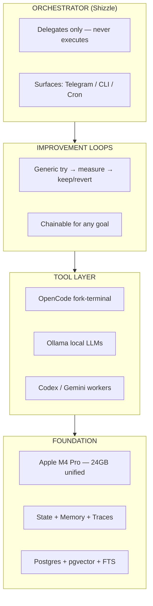
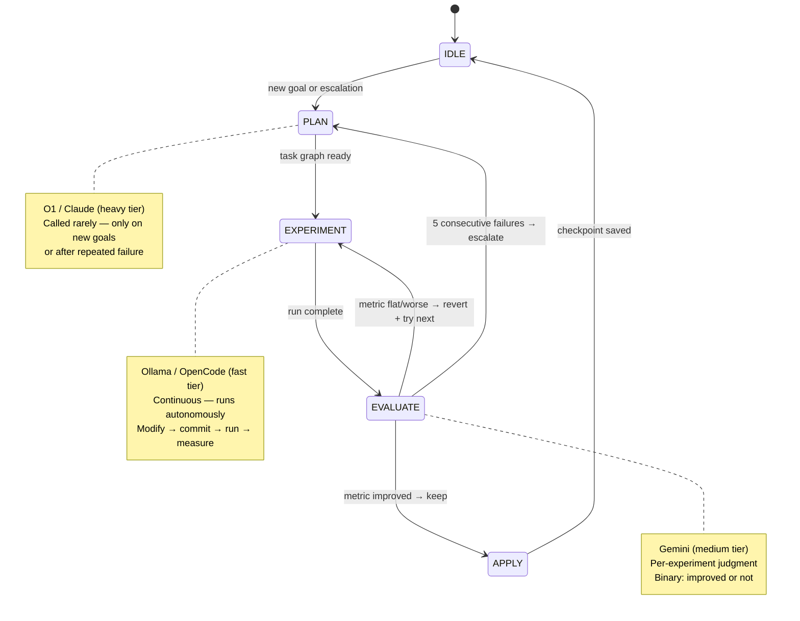
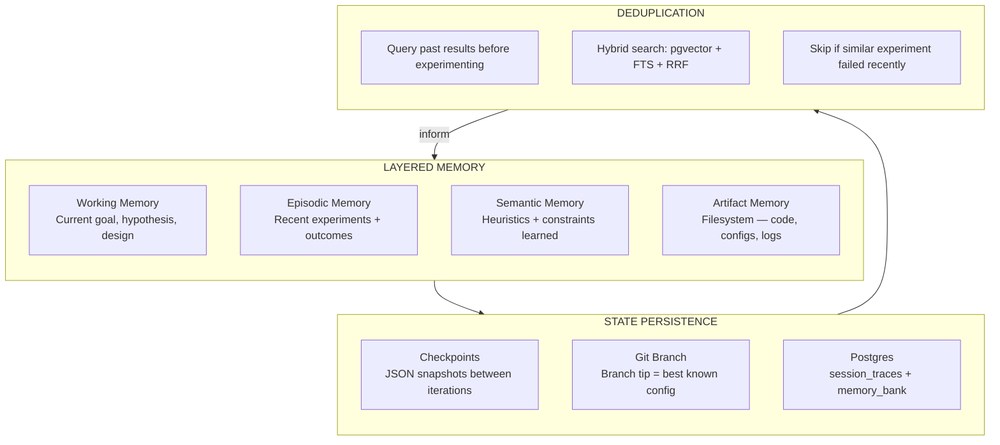
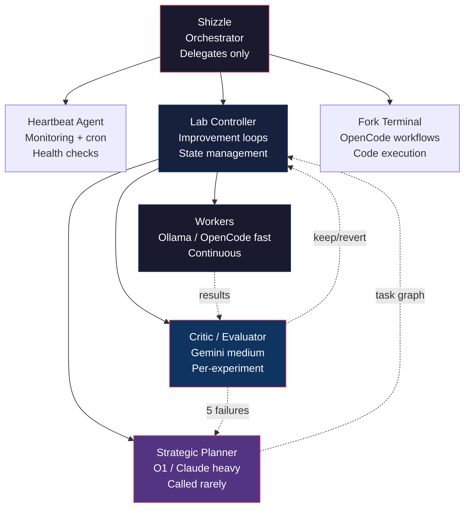
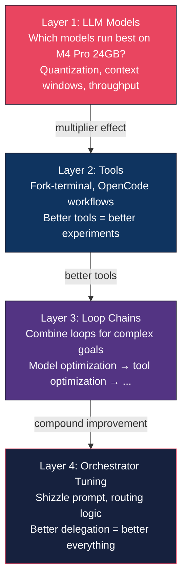
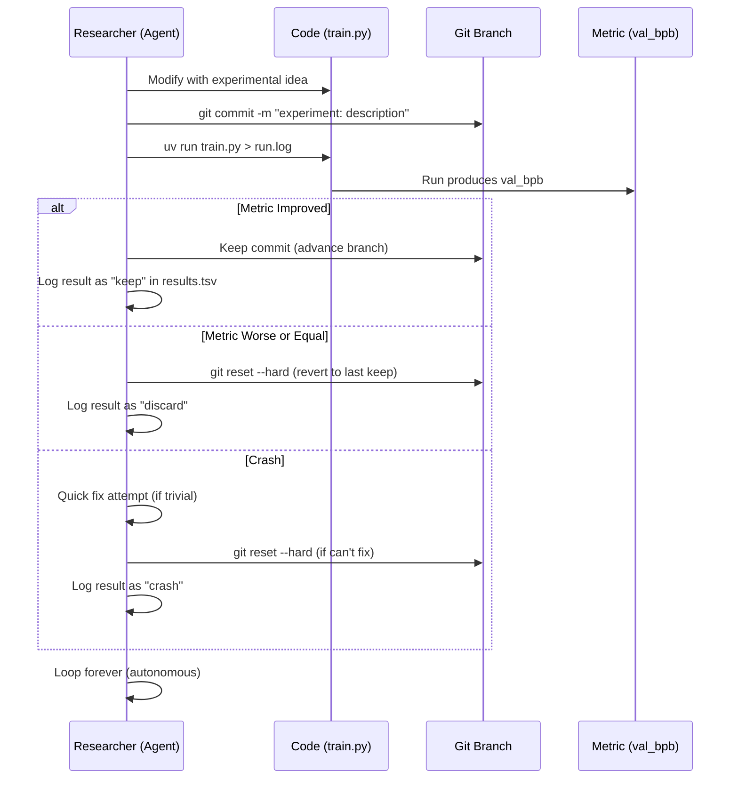

# Autonomous Self-Improvement Lab — Architecture

## 1. System Overview — The Three Layers



## 2. Improvement Loop (Generic)

The core loop follows the autoresearch discipline: every experiment is a discrete, measurable unit with an explicit keep/revert decision.



### Loop Invariants

1. **Every experiment is atomic** — committed before running, reverted on failure
2. **Metrics are the only truth** — no subjective "looks better"
3. **Memory prevents repetition** — query past results before starting
4. **Escalation is bounded** — max 5 failures before strategic replanning
5. **State survives crashes** — checkpointed between every iteration

## 3. Memory & State System



### Existing ai-lab/ Infrastructure

| Module | LOC | What It Does |
|--------|-----|-------------|
| `ai-lab/llm.py` | ~130 | Unified LLM client with transparent O1/O3 API quirk handling |
| `ai-lab/config.py` | ~101 | Model routing, safety thresholds, env config |
| `ai-lab/main.py` | ~186 | Three nested loops: strategic → project → experiment |
| `ai-lab/planner.py` | ~323 | O1 strategic planning + failure diagnosis |
| `ai-lab/critic.py` | ~113 | Critic/evaluator — rates worker output, suggests improvements |
| `ai-lab/worker.py` | ~65 | Stateless task execution (fast tier) |
| `ai-lab/state.py` | ~121 | 5-layer memory hierarchy, JSON serialization, resume support |
| `ai-lab/memory.py` | ~95 | Persistent skill heuristics + artifact registry |
| `ai-lab/tools.py` | ~86 | Deterministic tools: Python exec, shell, file I/O |

**Total: ~1,169 LOC of working infrastructure (+ ~400 LOC of strategy docs).**

### LangGraph vs Custom — Side-by-Side

This comparison is presented honestly for O1 to evaluate.

| Factor | LangGraph | Custom (extend aos/) |
|--------|-----------|---------------------|
| **Time to implement** | Days (turnkey graph execution) | Already built — `main.py` has all 3 loops |
| **State checkpointing** | Built-in (SQLite/Postgres backends) | `state.py` — JSON snapshots with resume (working) |
| **Graph-based routing** | Native nodes + edges + conditional branching | Manual controller loop in `main.py` (working) |
| **Memory integration** | LangGraph + LangMem library | `memory.py` skills DB + artifact registry (working) |
| **Embedding/retrieval** | Needs external setup | JSON tag-based now; can add vector search later |
| **Model routing** | LangChain model abstraction | `llm.py` + `config.py` 3-tier with O1 quirks handled |
| **Dependency weight** | Heavy — pulls langchain-core, langgraph, langsmith | 2 deps (openai, python-dotenv) |
| **Flexibility** | Framework-constrained, opinionated patterns | Full control over loop behavior |
| **Apple Silicon optimization** | Unknown — CUDA-focused ecosystem | Full control over Ollama/MLX integration |
| **Observability** | LangSmith (paid) or custom callbacks | Logging + state.db.json checkpoints (working, free) |
| **Community/docs** | Large, mature, many examples | Just us (but code is simple) |
| **Bloat risk** | High — LangChain transitive deps | Low — we own every line |
| **Upgrade risk** | API churn (LangChain ecosystem moves fast) | Stable — we control the interface |

**Key question for O1:** Given that ai-lab/ already provides a working three-loop orchestration, O1 API handling, state checkpointing, and escalation — is the incremental value of LangGraph's graph execution engine worth the dependency weight and loss of control?

## 4. Agent Topology



### Model Tier Mapping

| Role | Model | Tier | Cost | When Called |
|------|-------|------|------|-------------|
| Strategic Planner | O1 / Claude Opus | heavy | $$ | New goals, escalations only |
| Critic / Evaluator | Gemini 2.5 Flash | medium | ~$0.001/call | Every experiment |
| Worker / Executor | Ollama (llama3.3:70b on M4 Pro) | fast | $0 | Continuous |
| Orchestrator | Claude via Max sub | heavy | $0 (subscription) | Delegation decisions |

## 5. Optimization Sequence

The improvement loop optimizes the system in layers, where each layer multiplies the effectiveness of the next.



### Layer 1 Details: LLM Model Optimization

This is the foundation — everything else depends on fast, capable local models.

| Question | Why It Matters |
|----------|---------------|
| Which Ollama models fit in 24GB? | Memory ceiling determines model size |
| Quantization tradeoffs (Q4 vs Q5 vs Q8)? | Speed vs quality vs memory |
| Optimal context window for each role? | Workers need less context than planners |
| MLX vs Ollama for specific tasks? | MLX may be faster for some workloads |
| Can we run 2 models simultaneously? | Parallel worker + critic without swapping |

### Compound Improvement Example

```
Loop 1: Optimize local model selection
  → Find that Q5_K_M llama3.3 gives best speed/quality on M4 Pro
  → 40% faster inference for workers

Loop 2: Optimize fork-terminal workflows (using faster workers)
  → Discover parallel execution pattern
  → 3x throughput on multi-file changes

Loop 3: Chain loops 1+2 for codebase refactoring goal
  → Fast models + parallel execution = autonomous refactoring
  → What took 2 hours now takes 20 minutes
```

## 6. Autoresearch Pattern (Reference)

The autoresearch discipline we're abstracting:



**Key properties we preserve in our generic loop:**
1. Git branch as state management (branch tip = best known config)
2. Fixed evaluation metric (no subjective judgment)
3. Atomic experiments (commit before run, revert on failure)
4. Autonomous operation (never stop to ask — loop until interrupted)
5. Results logging (TSV/structured log of all attempts)
